# Project -1 (ATM)
Features:-✒️
It performs 3 functions:- credit, debit and show balance.
It comprises of 5 versions:-
v1-oops(Inheritance+polymorphism)
v2- oops+logical statement 
v3- oops+exception+logical statement 
v4- tkinter GUI
v5- GUI+file
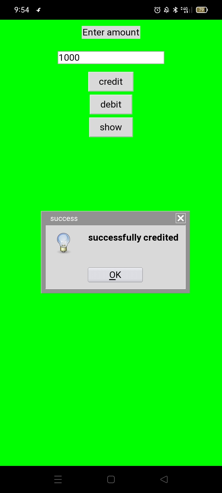
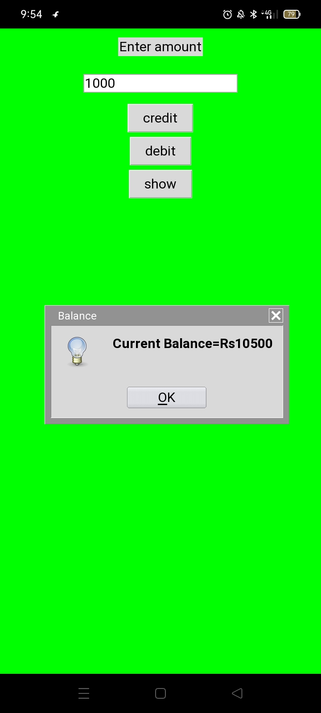

# Project -2 (To-do-list)
Features:-✒️
It is a simple program that show,add and delete tasks given by user.
It comprises of 2 versions:-
v1- logic statement+function
v2- oops 
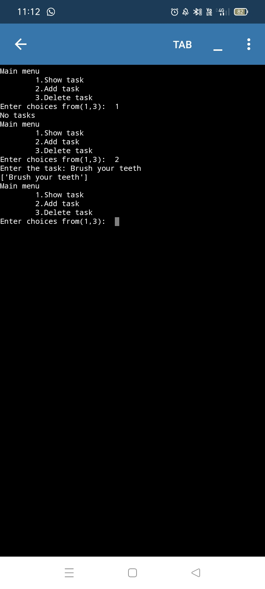

# Project -3 (Calculator)
Features:-✒️
It performs various arithmetic operations as selected by user such as addition, subtraction, multiplication...
It comprises of 3 versions:-
v1- smart calculator (loop+logical statement)
v2- simple calculator (loop+functions+logical statement)
v3- scientific calculator (oops)
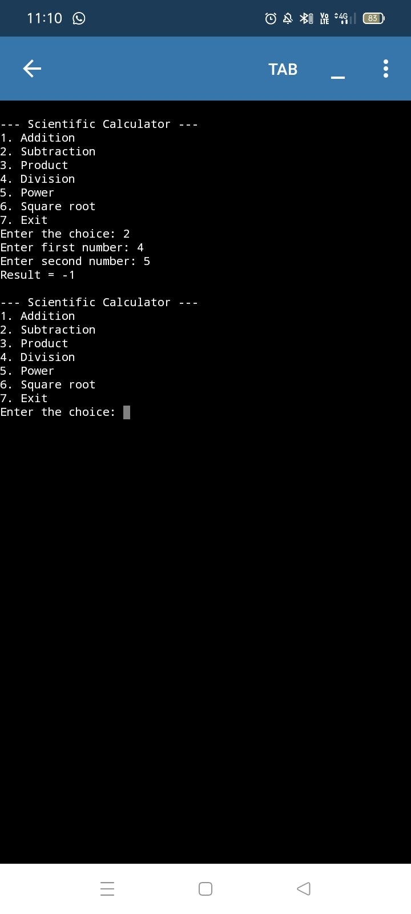

# Project -4 (Student Marksheet)
Features:-✒️
It provides the total marks obtained by students,its percentage as well as grade.
It comprises of 2 versions:-
v1- logical statement+ List
v2- Dictionary 
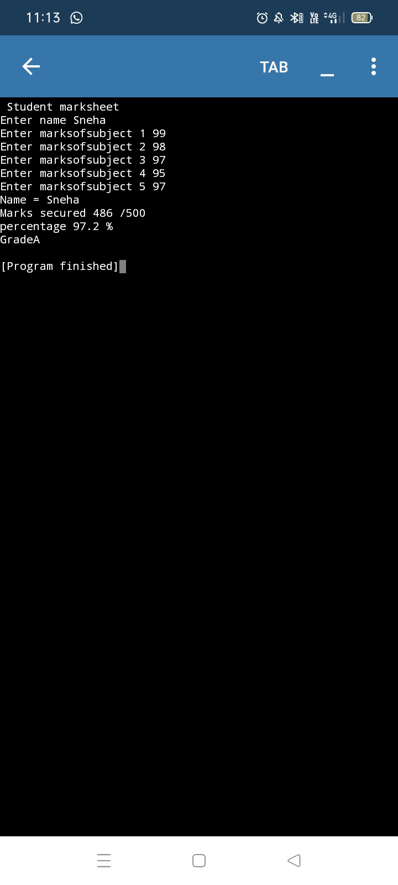

# Mini projects 
# 1. Contact book 
Features:-✒️
It search,show,add and delete numbers as instructed by user.
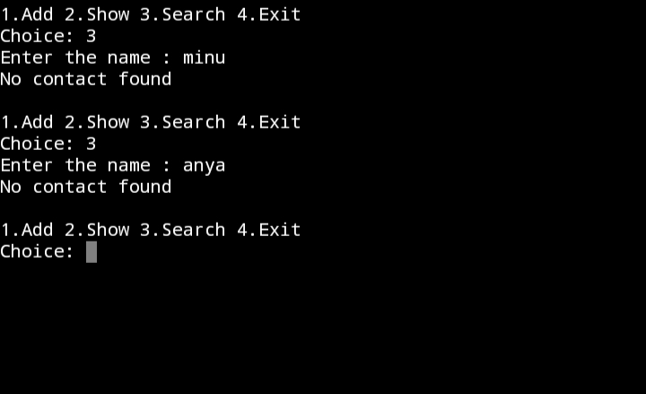

# 2. Fibonacci 
Features:-✒️
It prints the Fibonacci series till the input number provided by user.
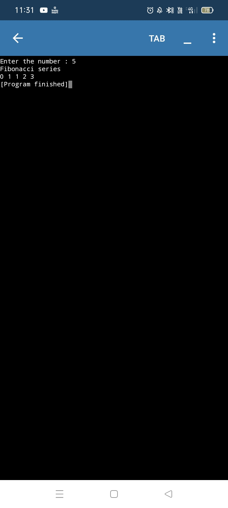

# ATM_Module
Features:-✒️
It is almost same as ATM. It only shows the use of import command

# 3.Quiz app
Features:-✒️
It is a simple terminal code that ask few questions from user and show their respective scores.

# 4. Display box
Features:-✒️
It is a simple GUI based program showing use of scroll box.

# 5.Currency convertor 
Features:-✒️
It uses python tkinter library and API key.
It takes amount from user and convert it into another currency as specified by user...

# 6.Joke generator 
Features:-✒️
It is a simple GUI app that fetches live jokes.
Categories:-"pun","misc","programming","spooky".
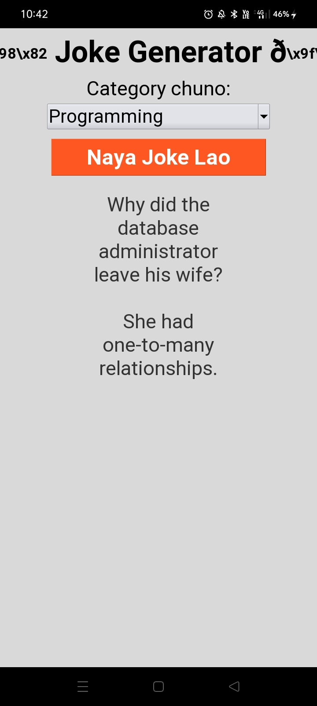

# 7.Password generator 
Features:-✒️
GUI based application.
Generates and copy password as per instructions given by user.
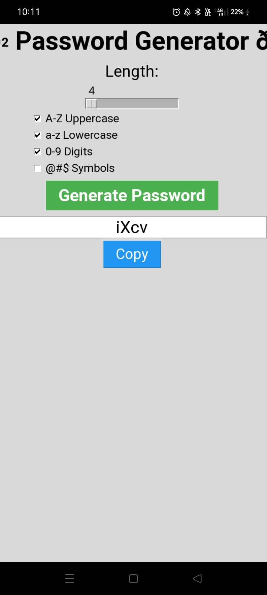

# 8. Bulk File Renamer 
Features:-✒️
It rename a large no. of files from a folder selected by user at once..

# Project-5 (Registration form)
Features:-✒️
It collects basic information from user such as name, address,email...
It contains 3 versions:-
v1- GUI (tkinter)
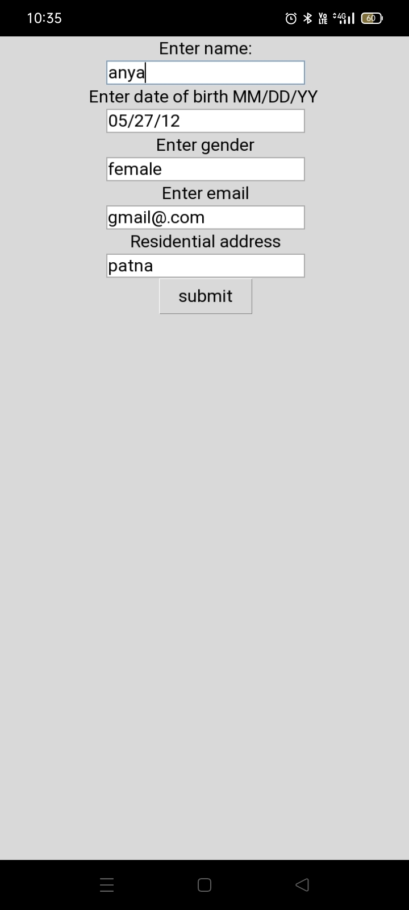
v2-GUI (drop down buttons)
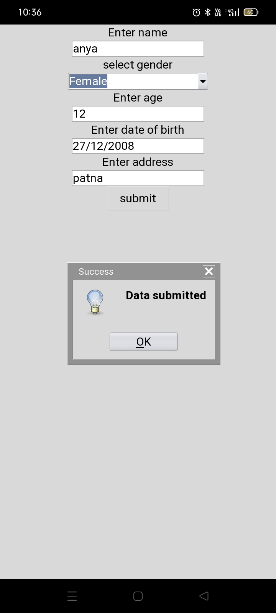
v3- GUI+ exception handling
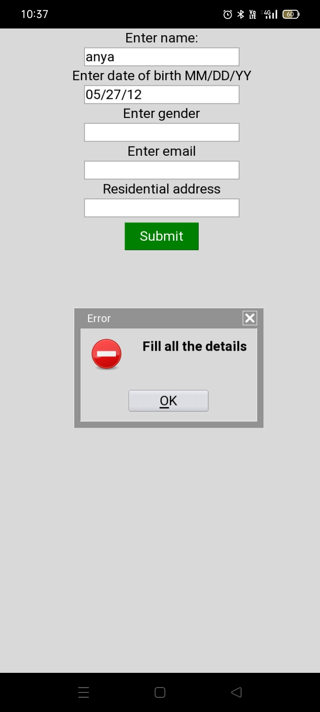

# Project - 6 (Chat interface)
Features:-✒️
It is a simple GUI based application.
It contains scrolled text box,GUI interface, Basic bot logic.
It consists of 2 versions:-
v1- Bot provide only one default message.
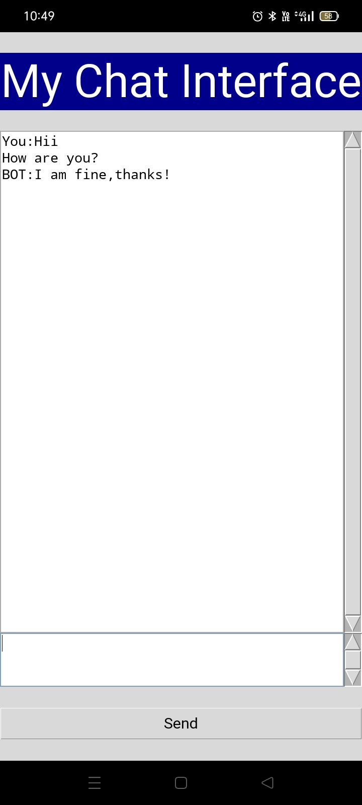
v2- user ke input ke hisab se jawab.
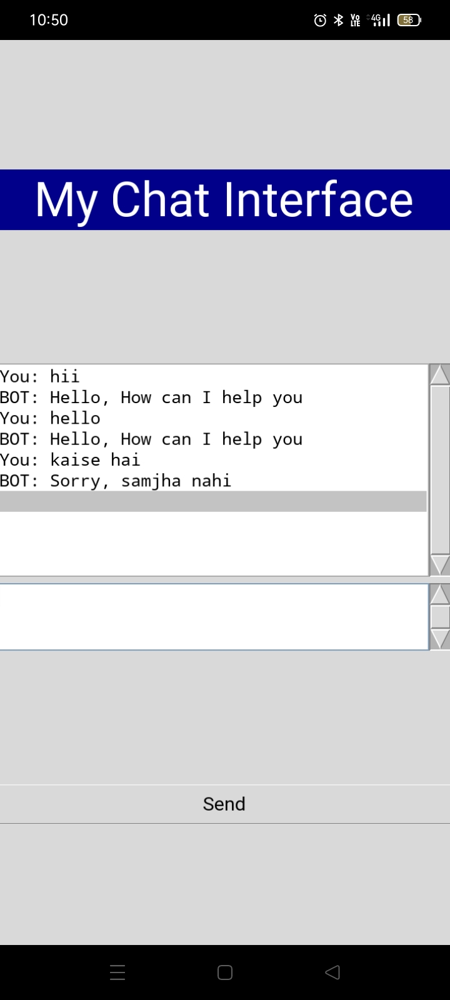

# Project-7 (Weather)
Features:-✒️
It extracts data from internet using API key.
It takes city name from user as input and show its weather condition as output.
It comprises of 2 versions:-
v1- simple terminal program 
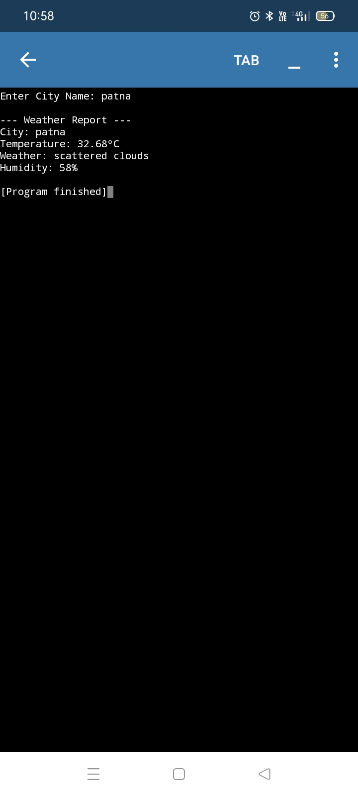
v2- GUI based 
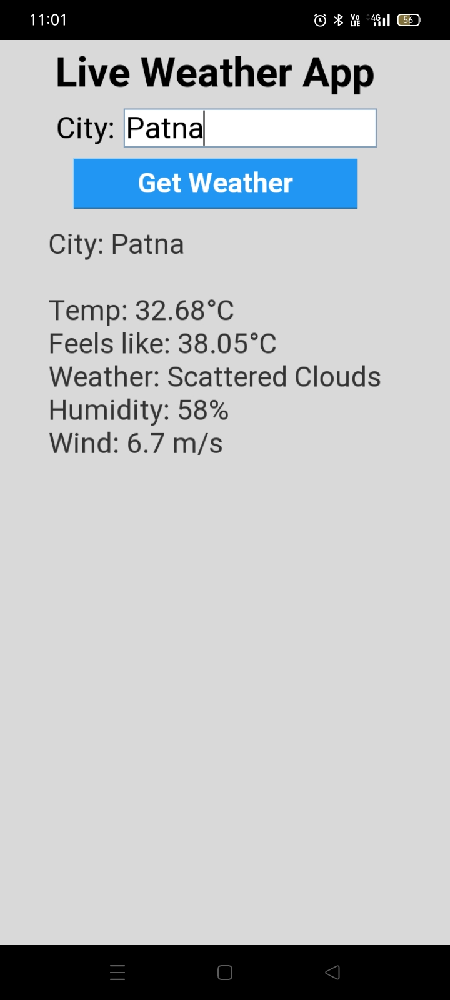

# Numpy library 
• Numpy Arrays 
Features:-✒️
1.Convert list into array and check dimensions 
2.To create n dimensional array 
3. create zeroes,ones, empty,range,linspace array..
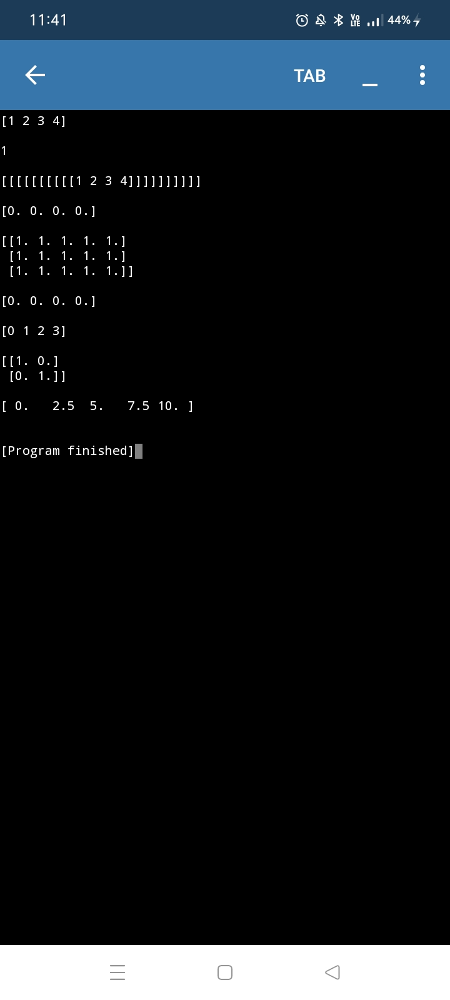

