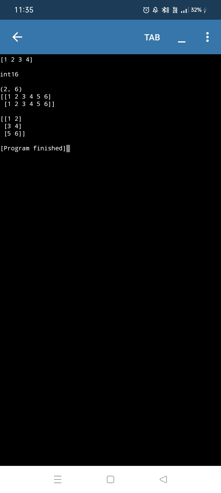
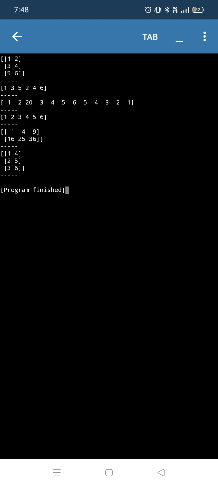
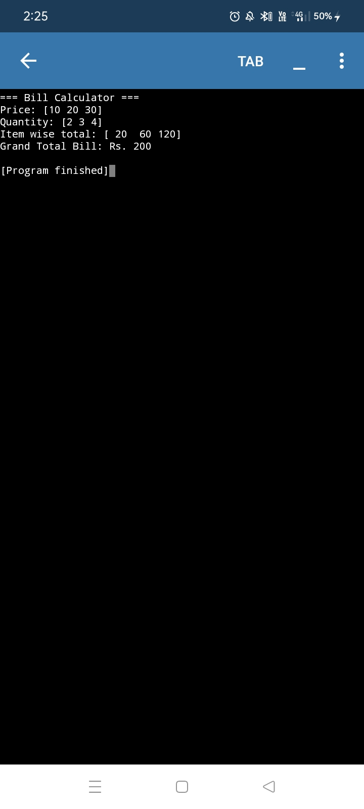
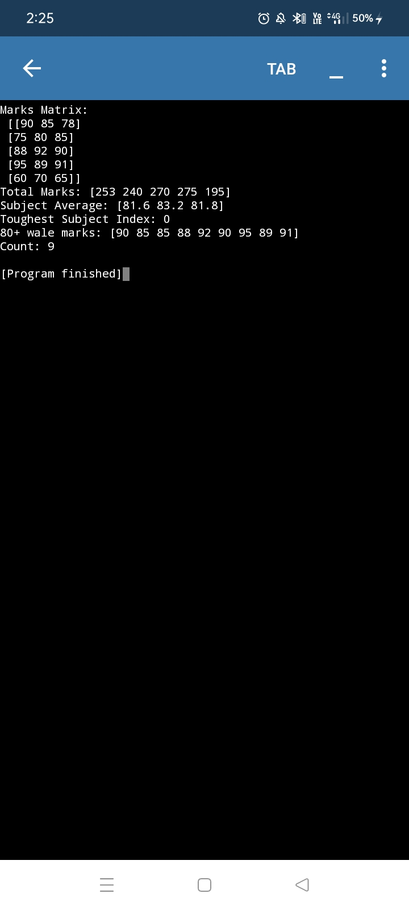
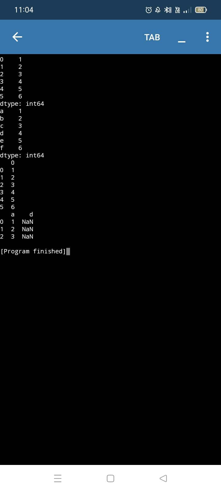
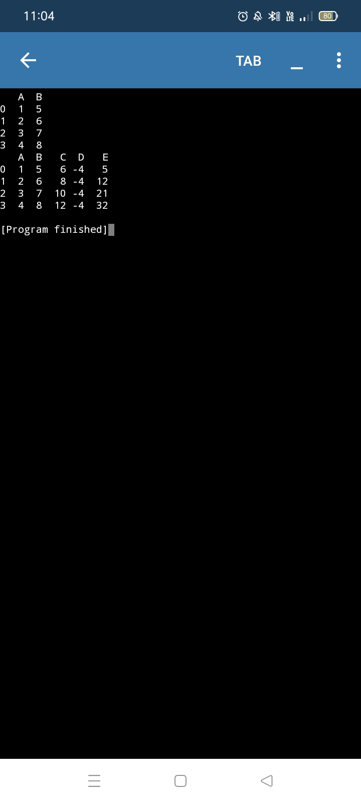
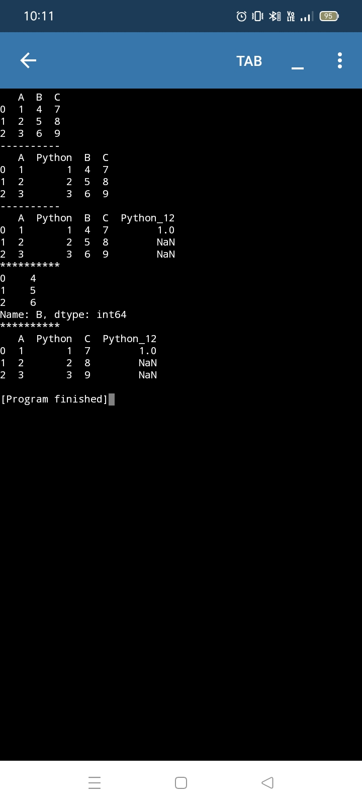
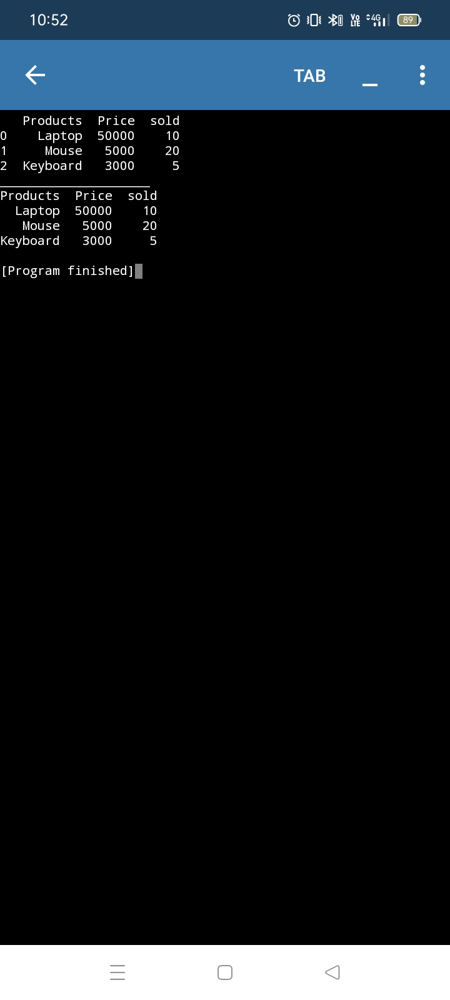

# Project -1 (ATM)
Features:-✒️
It performs 3 functions:- credit, debit and show balance.
It comprises of 5 versions:-
v1-oops(Inheritance+polymorphism)
v2- oops+logical statement 
v3- oops+exception+logical statement 
v4- tkinter GUI
v5- GUI+file

  
Click to view screenshots

  
  

  

# Project -2 (To-do-list)
Features:-✒️
It is a simple program that show,add and delete tasks given by user.
It comprises of 2 versions:-
v1- logic statement+function
v2- oops 

Click to view screenshots

  
  

# Project -3 (Calculator)
Features:-✒️
It performs various arithmetic operations as selected by user such as addition, subtraction, multiplication...
It comprises of 3 versions:-
v1- smart calculator (loop+logical statement)
v2- simple calculator (loop+functions+logical statement)
v3- scientific calculator (oops)

  
Click to view screenshots 

  

# Project -4 (Student Marksheet)
Features:-✒️
It provides the total marks obtained by students,its percentage as well as grade.
It comprises of 2 versions:-
v1- logical statement+ List
v2- Dictionary 

  
Click to view screenshots 

  

# Mini projects 
# 1. Contact book 
Features:-✒️
It search,show,add and delete numbers as instructed by user.

  
Click to view screenshots 

  

# 2. Fibonacci 
Features:-✒️
It prints the Fibonacci series till the input number provided by user.

  
Click to view screenshots 

  

# ATM_Module
Features:-✒️
It is almost same as ATM. It only shows the use of import command

# 3.Quiz app
Features:-✒️
It is a simple terminal code that ask few questions from user and show their respective scores.

# 4. Display box
Features:-✒️
It is a simple GUI based program showing use of scroll box.

# 5.Currency convertor 
Features:-✒️
It uses python tkinter library and API key.
It takes amount from user and convert it into another currency as specified by user...

  
Click to view screenshots 

  

# 6.Joke generator 
Features:-✒️
It is a simple GUI app that fetches live jokes.
Categories:-"pun","misc","programming","spooky".

  
Click to view screenshots 

  

# 7.Password generator 
Features:-✒️
GUI based application.
Generates and copy password as per instructions given by user.

  
Click to view screenshots 

  

# 8. Bulk File Renamer 
Features:-✒️
It rename a large no. of files from a folder selected by user at once..

# Project-5 (Registration form)
Features:-✒️
It collects basic information from user such as name, address,email...
It contains 3 versions:-
v1- GUI (tkinter)

  
Click to view screenshots 

  

  v2-GUI (drop down buttons)
  details>
  
Click to view screenshots 

  

v3- GUI+ exception handling
details>
  
Click to view screenshots 

  

# Project - 6 (Chat interface)
Features:-✒️
It is a simple GUI based application.
It contains scrolled text box,GUI interface, Basic bot logic.
It consists of 2 versions:-
v1- Bot provide only one default message.
details>
  
Click to view screenshots 

  

v2- user ke input ke hisab se jawab.
details>
  
Click to view screenshots 

  

# Project-7 (Weather)
Features:-✒️
It extracts data from internet using API key.
It takes city name from user as input and show its weather condition as output.
It comprises of 2 versions:-
v1- simple terminal program 
details>
  
Click to view screenshots 

  

v2- GUI based 
details>
  
Click to view screenshots 

  

# Numpy library 
• Numpy Arrays 
Features:-✒️
1.Convert list into array and check dimensions 
2.To create n dimensional array 
3. create zeroes,ones, empty,range,linspace array..
details>
  
Click to view screenshots 

  

•Random array and data types
Features:-✒️
It creates random array using inbuilt functions such as randn,rang,randint, etc.
• Conversion of data type, shape and reshaping 
Features:-✒️
It converts one data type into another and also shaping and reshaping arrays.
details>
  
Click to view screenshots 

  

•Numpy functions:-
Features:-✒️
It performs functions such as resize,flatten, insert, unique and matrix functions.
details>
  
Click to view screenshots 

  

•Bill calculator 
Features:-✒️
It calculates the item wise total as well as the total bill amount.
details>
  
Click to view screenshots 

  

•Marks analyzer
Features:-✒️
It calculates Total marks, subject wise avg, Toughest subject..
details>
  
Click to view screenshots 

  

# Pandas 
• Basics
Features:-✒️
It creates a data frame,name all the columns and also the shape and data type.
• Series_Dataframe
Features:-✒️
It depicts the use of pandas data structures i.e, series and data frame.
It also provide code to change the index of the data frame.
details>
  
Click to view screenshots 

  

•Arithmetic operations 
Features:-✒️
It depicts some of the basic arithmetic operations that can be performed on data in pandas.
details>
  
Click to view screenshots 

  

• Insert and Delete 
Features:-✒️
It shows how one can insert and delete data from data frame created in pandas..
details>
  
Click to view screenshots 

  

• Write and read
Features:-
It depicts how to create a csv file in pandas and read data from it.
details>
  
Click to view screenshots 

  

